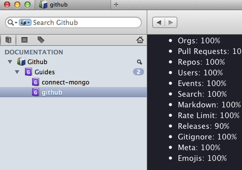

### Usage
* use `repository.json` to configure which repository you want to get and contain in the docset of [Dash](http://kapeli.com/dash)

 ```json
{
  "repos": {
        "github":"mikedeboer/node-github",
        "connect-mongo":"kcbanner/connect-mongo"
  }
}
 ```

* use generate.sh to create the docset

 ```shell
 $ sh generate.sh github
 ```
 
 
 